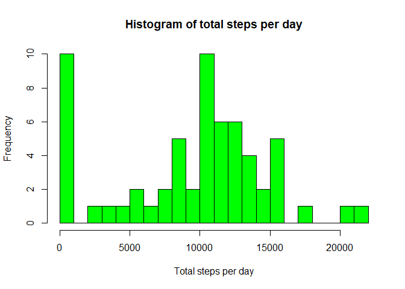
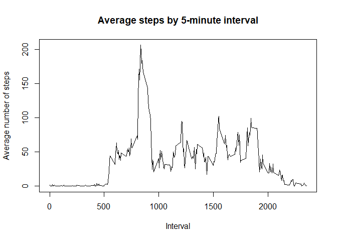

## Loading and preprocessing the data

Reading data from csv


```r
df <- read.csv("activity.csv")
head(df)
```

```
##   steps       date interval
## 1    NA 2012-10-01        0
## 2    NA 2012-10-01        5
## 3    NA 2012-10-01       10
## 4    NA 2012-10-01       15
## 5    NA 2012-10-01       20
## 6    NA 2012-10-01       25
```

```r
print(colnames(df))
```

```
## [1] "steps"    "date"     "interval"
```

```r
options(scipen = 100)
```


## What is mean total number of steps taken per day?


```r
total.steps <- tapply(df$steps, df$date, sum, na.rm = T)
hist(total.steps, 
	main = "Histogram of total steps per day", 
	xlab = "Total steps per day", 
	ylab = "Frequency", 
	breaks = 20,
	col = "green"
)
```

<!-- -->

```r
steps.mean <- mean(total.steps, na.rm = T)
steps.median <- median(total.steps, na.rm = T)
```

The mean number of steps taken each day is 9354, the median number is 10395. 


## What is the average daily activity pattern?


```r
steps.interval <- aggregate(df$steps, list(df$interval), mean, na.rm = T)
colnames(steps.interval) <- c("interval", "steps")
plot(steps.interval, type = "l",
	main = "Average steps by 5-minute interval",
	xlab = "Interval",
	ylab = "Average number of steps",
)
```

<!-- -->

5-minute interval, on average across all the days in the dataset that contains the maximum number of steps


```r
max <- steps.interval[which.max(steps.interval$steps),]
```

Maximum average is in the interval 835

## Imputing missing values

Number of NA Values


```r
nrow(df[is.na(df$steps), ])
```

```
## [1] 2304
```

Loading important libraries. Imputing data using impute function. 


```r
library(scales)
library(Hmisc)
```

```
## Loading required package: lattice
```

```
## Loading required package: survival
```

```
## Loading required package: Formula
```

```
## Loading required package: ggplot2
```

```
## 
## Attaching package: 'Hmisc'
```

```
## The following objects are masked from 'package:base':
## 
##     format.pval, units
```

```r
imputedData <- df
imputedData$steps <- impute(df$steps, fun = mean)
head(imputedData)
```

```
##     steps       date interval
## 1 37.3826 2012-10-01        0
## 2 37.3826 2012-10-01        5
## 3 37.3826 2012-10-01       10
## 4 37.3826 2012-10-01       15
## 5 37.3826 2012-10-01       20
## 6 37.3826 2012-10-01       25
```

Make a histogram of the total number of steps taken each day 


```r
total.na.steps <- tapply(imputedData$steps, imputedData$date, sum)
hist(total.na.steps, 
	main = "Histogram of total steps per day", 
	xlab = "Total steps per day", 
	ylab = "Frequency", 
	breaks = 20,
	col = "red"
)
```

<!-- -->

```r
steps.mean <- mean(total.na.steps)
steps.median <- median(total.na.steps)
```

The mean number of steps taken each day is 10766, the median number is 10766. 


## Are there differences in activity patterns between weekdays and weekends?


```r
imputedData$datetype <- ifelse(as.POSIXlt(imputedData$date)$wday %in% c(0,6), 'weekend', 'weekday') 
```

### Make a panel plot


```r
averageActivity <- aggregate(steps ~ interval + datetype, data = imputedData, mean)
ggplot(averageActivity, aes(interval, steps)) + 
  geom_line() + 
  facet_grid(datetype ~ .) + 
  xlab("5-minute interval") + 
  ylab("avarage number of steps")
```

<!-- -->

